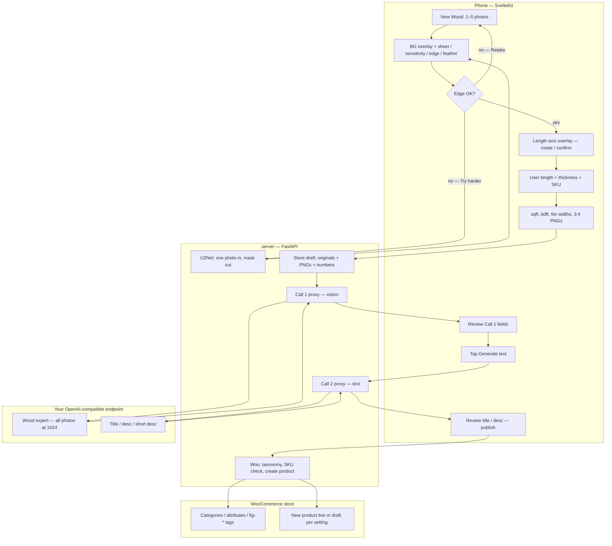

# Architecture

Status: SPEC · 2026-08-27 · SlabUploader  
Locked so far: topology C (hybrid), swimlane, what-runs-where. Remaining sections TBD.

Companion: PRD (root), TECH-SPEC-PIPELINE.md.

## 1. Topology (hybrid)

Phone does the happy-path pipeline (mask, length axis, sqft/bdft, 3:4 PNG).  
FastAPI stores drafts, runs U2Net only on demand, proxies inference, talks to Woo.  
reverse proxy terminates HTTPS.

```
phone (SvelteKit)
  capture, mask, sliders, length axis, sqft/bdft, 3:4 PNG
  if mask still bad → POST one photo → FastAPI U2Net → mask back → user continues

server
  reverse proxy → frontend (static)
        → fastapi : store, settings, taxonomy, Woo, inference proxy, U2Net, prompt files
```

- Happy path never leaves the phone.
- U2Net is explicit “Try harder” (or coverage failure), not every slab.
- Woo + LLM keys stay on the server. Browser does not call Woo or the vision endpoint directly.

## 2. Swimlane



## 3. Clarifications

1. **Happy path** stays on the phone through PNG + numbers. FastAPI is idle until the user has a confirmed mask (or taps Try harder).
2. **Try harder** is U2Net on **one photo** (the one on screen). Mask comes back; sliders still apply. Not a full re-pipeline on the server.
3. **Draft upload** sends **originals + processed PNGs + length/thickness/SKU/sqft/bdft/widths**. Originals are needed if Call 1 or a later retry must not depend on the tab still being open. After successful Woo publish, server deletes both.
4. **Call 1** is server-side so the vision key never sits in the browser. Auto-run
   on slab create **only if** `inference_enabled` is true. If disabled, Call 1
   is skipped; user can manually fill taxonomy and still trigger Call 2. Body:
   all originals downscaled to 1024 + Woo taxonomy snapshot + SKU/length/thickness.
   Timeout 45s → error + retry on the phone. User reviews/corrects results.
5. **Call 2** does not auto-fire. User taps Generate text. Server sends curated
   Call 1 results (or manually-entered taxonomy if Call 1 failed) + deterministic
   numbers + brand/GEO for prose generation; assembles title/description/short
   description from deterministic templates with the LLM prose injected.
6. **Woo** is only FastAPI. Browser never sees the App Password. Duplicate SKU → stop, show error, no edit-same-SKU in MVP.
7. **Settings** (species $/bdft, prompts, endpoint, Woo, publish status) live on the server; the phone is just the form.

## 4. What runs where

| Job | Where |
|---|---|
| Camera, 1-5 photos | Client |
| Sheet detect, chroma-key / black threshold, sliders, flood-fill | Client |
| U2Net | Server, on demand |
| Length axis overlay, 6" widths, sqft, bdft | Client |
| 3:4 PNG, 80% fill (configurable aspect) | Client |
| Draft + originals + processed PNGs | Server (after user continues) |
| Species $/bdft, Woo creds, prompts, brand/GEO | Server |
| Call 1 (vision, all photos @1024) | Server proxy |
| Call 2 (title/desc) | Server proxy, after Call 1 curation |
| Woo taxonomy sync + publish | Server |

## 5. Secrets and settings

**Server-side only (never in browser JS):**
1. WooCommerce consumer key + consumer secret (App Password). Server uses HTTP Basic Auth to call `/wp-json/wc/v3/`. Stored encrypted at rest in SQLite (AES-GCM).
2. Inference endpoint base URL + API key. Stored encrypted. Server proxies all inference calls.
3. AES master key. Env var on server, never in the DB.

**Browser-side (no secrets):**
1. User preferences: sheet mode, sensitivity, edge offset, feather. Persisted in localStorage, reset-to-default available.
2. Species list with $/bdft. Read from server settings sync.
3. Taxonomy snapshot (categories, attributes, tags). Read from server. No auth needed.

**Flow:**
1. User enters Woo credentials in Settings UI on the phone.
2. Browser POSTs them to `/api/settings` on FastAPI. Server stores encrypted.
3. Server syncs taxonomy from Woo, caches in SQLite.
4. Client reads taxonomy from `/api/admin/taxonomy` — no auth needed.
5. All Woo calls go server-to-woo. Browser never calls Woo REST directly.

This is the canonical WooCommerce App Password integration pattern. Browser-to-Woo REST requires CORS configuration on the Woo site, which is not under your control.

## 6. Status machine

```
draft → calibrated → ready → publishing → published
         │              │                ↑
         └→ failed  ────┴────────────────┘ (woo_product_id set)
any → failed (with error)
```

1. **draft** — user took photos, no mask confirmed yet.
2. **calibrated** — user confirmed the BG edge, confirmed length axis, entered length/thickness/SKU. Client computed sqft/bdft/widths. Draft uploaded to server.
3. **ready** — all mandatory fields populated (species, wood category, edge type, figure, grade, thickness, price, title/desc/short desc, at least one photo). Values can come from Call 1, manual entry, or a mix. Inference is optional; the user can fill everything by hand and go straight to ready.
4. **publishing** — Woo create in flight. Poll for result.
5. **published** — Woo product created, woo_product_id stored. Images purged.
6. **failed** — pipeline, inference, or publish error. Error detail stored. Retry available.

Call 1 and Call 2 are assist-only. They do not gate the flow. If the user skips inference, the path is: calibrated → ready → publishing → published.
