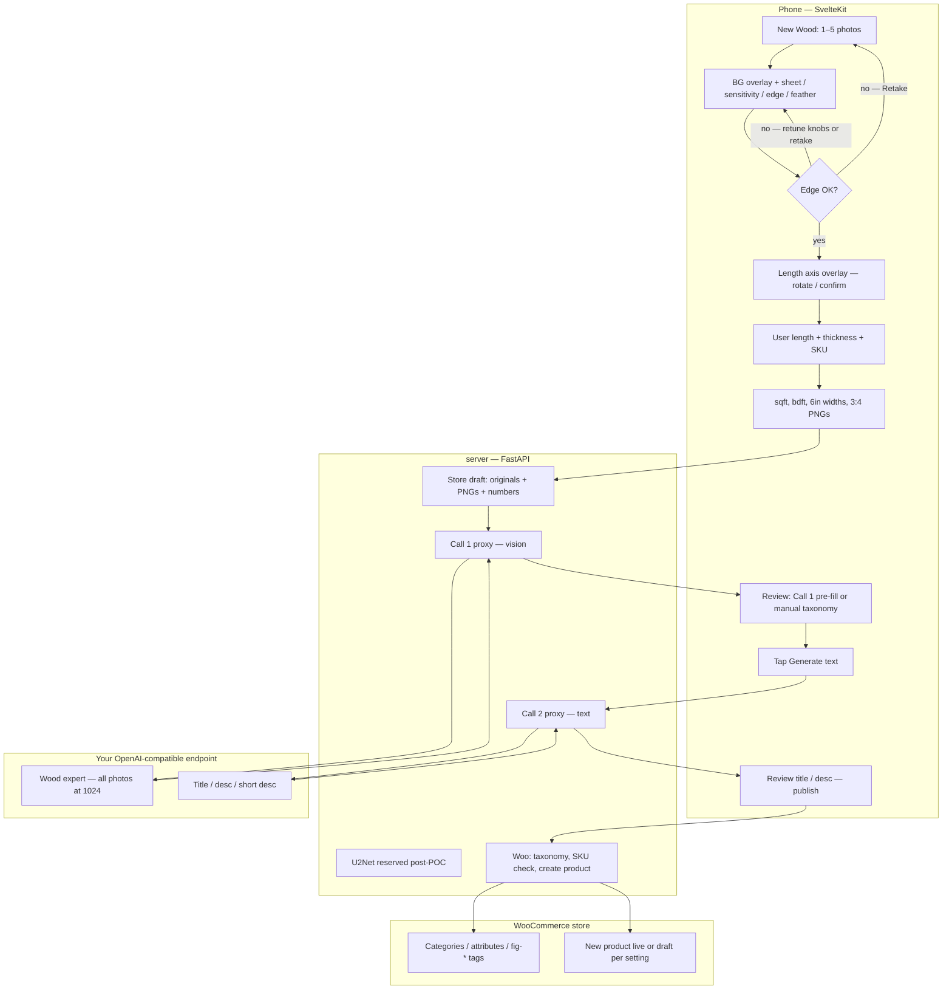

# Architecture

Status: SPEC · hybrid topology locked at Gate A freeze (2026-08-31) · SlabUploader

Normative for hybrid split, swimlane, what-runs-where, secrets **why**, and status
transitions. Ops depth lives in DEPLOYMENT. Schema enums live in DATA-MODEL.
Agent-facing hard rules live in AGENTS.md (verbatim locks stay there).

Companion: `docs/TECH-SPEC-PIPELINE.md`. Historical PRD: `docs/archive/PRD-2026-08.txt` (frozen; not a source for new work). Agent locks: `AGENTS.md`.

## 1. Topology (hybrid)

Phone does the happy-path pipeline (mask knobs, length axis, sqft/bdft, 3:4 PNG).
FastAPI stores drafts, proxies inference, talks to Woo. reverse proxy terminates HTTPS.
Server U2Net (“Try harder”) is **deferred from POC**, not deleted.

```
phone (SvelteKit)
  capture, four knobs inline, live mask overlay on the source photo,
  length axis, sqft/bdft, 3:4 PNG
  (POC: retake if mask still bad — no U2Net control)

server
  reverse proxy → frontend (static)
        → fastapi : store, settings, taxonomy cache, Woo, inference proxy, prompt files
        → U2Net endpoint reserved post-POC
```

- Happy path never leaves the phone.
- Mask knobs live on capture; changing a knob re-runs client BG removal immediately.
- Woo + LLM keys stay on the server. Browser does not call Woo or the vision endpoint directly.

## 2. Swimlane



## 3. Clarifications

1. **Happy path** stays on the phone through PNG + numbers. FastAPI is idle until the user has a confirmed mask.
2. **Mask knobs** live on capture; each change re-runs client BG removal. Server U2Net “Try harder” is deferred from POC (keep the one-photo contract; do not ship the control).
3. **Draft upload** sends **originals + processed PNGs + length/thickness/SKU/sqft/bdft/widths**. Originals are needed if Call 1 or a later retry must not depend on the tab still being open. After successful Woo publish, server deletes both.
4. **Call 1** is server-side so the vision key never sits in the browser. Auto-run
   on slab create **only if** `inference_enabled` is true. If disabled, Call 1
   is skipped; user can manually fill taxonomy and still trigger Call 2. Body:
   all originals downscaled to 1024 + **Woo-synced taxonomy only** + SKU/length/thickness.
   Timeout 45s → error + retry on the phone. ≥0.7 confidence **pre-populates**
   species, wood categories, edge/figure/grade, feat-* (mutable). Below 0.7 those
   fields stay **empty**. Manual entry stays authoritative. Presentation: `docs/UX.md`.
5. **Call 2** does not auto-fire. User taps Generate text. Server must send
   **portable Call 1 context** (default: full conversation resend). Stateful
   `previous_response_id` only after `test-inference` proves the provider supports
   it. Call 2 inputs distinguish confirmed user values from inferred ones. Per-slab
   thread; delete on submit or abandon.
6. **Woo** is only FastAPI. Browser never sees the WordPress application
   password. Duplicate SKU → 409 mapped on the SKU field (edit SKU or open existing).
   Stale value → 422 on that field. Draft stays on the phone.
7. **Settings** (species $/bdft, prompts, inference endpoint, Woo credentials,
   publish status) live on the server. Store URL is env, displayed read-only.

## 4. What runs where

| Job | Where |
|---|---|
| Camera, 1-5 photos | Client |
| Sheet detect, chroma-key / black threshold, four knobs, live re-run, flood-fill | Client |
| U2Net “Try harder” | Server, **deferred from POC** |
| Length axis overlay, 6" widths, sqft, bdft | Client |
| 3:4 PNG, 80% fill (configurable aspect) | Client |
| Draft + originals + processed PNGs | Server (after user continues) |
| Species $/bdft, Woo creds, prompts, brand/GEO | Server |
| Call 1 (vision, all photos @1024) | Server proxy |
| Call 2 (title/desc) | Server proxy, after Call 1 curation |
| Woo taxonomy sync + publish | Server |

## 5. Secrets and settings

**Server-side only (never in browser JS):**
1. WordPress username + **application password** for a dedicated low-privilege
   WP user. Server uses HTTP Basic Auth (`username:application_password`) against
   `/wp-json/wc/v3/`. Stored encrypted at rest in SQLite (AES-GCM). Not Woo
   consumer keys. Not the account login password.
2. Inference endpoint base URL + API key. Stored encrypted. Server proxies all
   inference calls.
3. AES master key. Env var on server (`SLAB_AES_KEY`), never in the DB.
4. `WOO_BASE_URL` env (compose). HTTPS only. Not user-editable; Settings displays it read-only.

**Browser-side (no secrets):**
1. User preferences: sheet mode, sensitivity, edge offset, feather. Persisted in localStorage, reset-to-default available.
2. Species list with $/bdft. Read from server settings sync.
3. Taxonomy snapshot (categories, attributes, tags). Read from server. No auth needed.

**Flow:**
1. Deploy sets `WOO_BASE_URL` (`https://`) in compose. Operator creates a
   low-privilege WP user on that store (HTTPS required for Application
   Passwords UI). Generates an application password under Users → Profile.
2. User enters that username + application password in Settings UI
   (store URL shown read-only from env).
3. Browser POSTs them to `/api/v1/settings` on FastAPI. Server encrypts with
   AES-GCM and stores ciphertext only.
4. Server syncs taxonomy from Woo, caches in SQLite.
5. Client reads taxonomy from `/api/v1/admin/taxonomy` — no auth needed.
6. All Woo calls go server-to-Woo. Browser never calls Woo REST directly.

Browser-to-Woo REST would need CORS on the store, which this design does not use.

## 6. Status machine

```
draft → calibrated → ready → publishing → published
         │              │                ↑
         └→ failed  ────┴────────────────┘ (woo_product_id set)
any → failed (with error)
```

1. **draft** — user took photos, no mask confirmed yet.
2. **calibrated** — user confirmed the BG edge, confirmed length axis, entered length/thickness/SKU. Client computed sqft/bdft/widths. Draft uploaded to server.
3. **ready** — all mandatory fields populated (species, wood category, edge type,
   figure, grade, thickness, price, title/desc/short desc, at least one photo).
   Values can come from Call 1 (≥ 0.7 pre-fill the user kept), manual entry, or a mix.
   **Review gate:** below-threshold Call 1 leaves that field empty. Mandatory before
   ready: **exactly one species, ≥1 wood category, ≥1 figure**. Inline nudges, not
   submit-only (`docs/UX.md`). Inference is optional; with inference OFF the user
   fills everything by hand.
4. **publishing** — Woo create in flight. Poll for result.
5. **published** — Woo product created, woo_product_id stored. Images purged.
6. **failed** — pipeline, inference, or publish error. Error detail stored. Retry available.

Call 1 and Call 2 are assist-only. They do not gate publish. Low-confidence Call 1
results do not auto-fill. If the user skips inference, the path is: calibrated →
ready → publishing → published.

## 7. Taxonomy cache (manufactured last-modified)

Woo REST exposes **no usable last-modified** on categories, attributes, or tags
(only products carry `date_modified`). The client never talks to Woo. FastAPI is
the sole freshness source and **manufactures** one anchor timestamp
(`taxonomy_updated_at` / `cache_anchor`).

- Anchor bumps **only** when a row-level change is detected in the **stored
  subset** of cache fields (whatever columns the cache tables actually keep:
  species/wood-category leaves, five attributes + terms, `fig-*`/`feat-*` tags).
  Scope is schema-driven: adding a cache column later automatically includes it.
- Spelling/name edits, additions, and deletions all bump. Diff must catch missing
  rows (deletions), not only changed rows.
- A no-op sync (stored subset unchanged) **does not** bump, so the client does
  not churn.
- Client reads the anchor. If it advanced past the client's last value, re-pull
  the **full** taxonomy cache. One timestamp governs categories, attributes, and
  tags together.
- Do not invent a Woo-side taxonomy timestamp or a per-table anchor.

**Triggers**

1. `POST /api/v1/settings/test-woo` **always** resyncs taxonomy after a successful
   connection test (unlocks the species list).
2. Publish / product submit: opportunistic resync if the last successful sync is
   older than **1 hour**; bump anchor only if the stored subset changed.
3. Optional: app launch check (sync only if stale) and a Settings “Refresh
   taxonomy” control. Not required for POC.
4. Do **not** sync on every screen navigation.

Species pickers and Call 1 option lists are **exactly** this cached set. No
hardcoded, invented, or fallback species list. A new Woo species is selectable
only after the next sync that lands it in the cache.

## 8. Shared validation module

One FastAPI module is source of truth for field rules (required, length cap, charset, Woo option membership). Client caches `{ rules, hash }`.

- Field-exit: local check against the cache.
- Length: hard input cap (cannot type past Woo max).
- Hash is compared **on submit only**. Mismatch → refresh module → re-validate → retry. Draft stays.

## 9. Call 1 → Call 2 context

Providers differ. Default portable path: **resend the full Call 1 turn** (prompt + images metadata + assistant JSON) with Call 2. Opt into `previous_response_id` only after probe.

`POST /api/v1/settings/test-inference` fails closed (`ok: false`) if **neither** full-resend nor stateful id works. Do not ship a Call 2 that silently drops Call 1 context.

Per-slab thread. Delete stored thread on successful publish or user abandon.

Presentation of the review screen: `docs/UX.md`.
